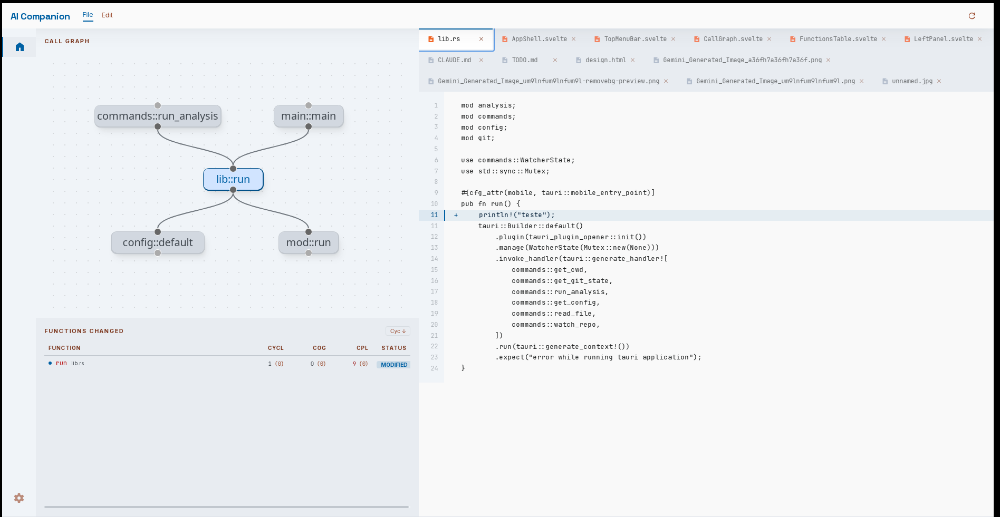

# aicompanion

<p align="center">
  
</p>

A desktop GUI for reviewing AI-generated code changes. Run it inside any git repository to get an instant complexity analysis of everything that has changed since the last commit.



## Why

AI code generation can introduce functions that are technically correct but hard to maintain — deeply nested logic, large fan-out, or tightly coupled call chains. aicompanion surfaces these problems at review time, before the code is merged.

## Installation

```
git clone https://github.com/tncardoso/aicompanion
cd aicompanion
bun install
bun tauri build
```

The compiled app will be in `src-tauri/target/release/`.

## Usage

Launch the app and use the directory picker to open any git repository. The tool shows changes between the working tree and `HEAD` — staged, unstaged, and new untracked source files are all included. It reloads automatically when files change.

## Complexity metrics

Three metrics are computed for every function in every changed file using [tree-sitter](https://tree-sitter.github.io/tree-sitter/) to parse the source code.

### Cyclomatic complexity

Counts the number of independent execution paths through a function. Each decision point — `if`, `while`, `for`, `loop`, `match` arm, or boolean operator (`&&` / `||`) — adds one to the count, which starts at 1 (the straight-line path).

A function with cyclomatic complexity 1 has no branches. A function with complexity 10 has 10 distinct paths that tests would need to cover to achieve full branch coverage.

### Cognitive complexity

Measures how hard a function is to read, as distinct from how many paths it has. Nesting is penalised: each level of nesting adds an extra point on top of the base cost of the control structure. A flat chain of `if`/`else if` costs less than the same conditions written as nested `if` blocks, even though both have identical cyclomatic complexity.

The scoring follows the same principles as the [Cognitive Complexity specification](https://www.sonarsource.com/docs/CognitiveComplexity.pdf) by G. Ann Campbell:

- Each control flow structure (`if`, `for`, `while`, `match`, etc.) adds 1.
- Each level of nesting adds 1 more on top.

### Coupling (fan-out)

Counts the number of distinct functions or methods that a function calls. High coupling means the function depends on many other units of code, making it harder to test in isolation and more likely to break when its dependencies change.

## Configuration

Place `.aicompanion.toml` in the repository root to override the warning thresholds:

```toml
[thresholds]
cyclomatic = 10   # default
cognitive  = 15   # default
coupling   = 5    # default
```

## Supported languages

Rust, Python, JavaScript, TypeScript, Go, C, C++.

