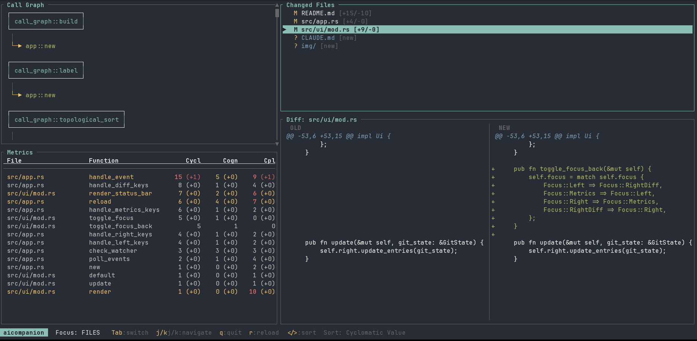

# aicompanion

<p align="center">
  
</p>

A terminal UI for reviewing AI-generated code changes. Run it inside any git repository to get an instant complexity analysis of everything that has changed since the last commit.



## Why

AI code generation can introduce functions that are technically correct but hard to maintain — deeply nested logic, large fan-out, or tightly coupled call chains. aicompanion surfaces these problems at review time, before the code is merged.

## Installation

```
git clone https://github.com/tncardoso/aicompanion
cd aicompanion
cargo build --release
cp target/release/aicompanion ~/.local/bin/
```

## Usage

Run from inside any git repository:

```
cd your-project
aicompanion
```

Run from a subdirectory to scope the analysis to that subtree:

```
cd your-project/src/api
aicompanion
```

The tool shows changes between the working tree and `HEAD` — staged, unstaged, and new untracked source files are all included. It reloads automatically when files change (~50 ms debounce).

## Keys

`Tab` / `Shift+Tab` cycle focus forward and backward: **LEFT** → **METRICS** → **FILES** → **DIFF** → **LEFT**

| Key | LEFT focus | METRICS focus | FILES focus | DIFF focus |
|-----|------------|---------------|-------------|------------|
| `j` / `↓` | Scroll call graph down | Scroll metrics down | Next file | Scroll down 1 line |
| `k` / `↑` | Scroll call graph up | Scroll metrics up | Prev file | Scroll up 1 line |
| `d` | — | Scroll metrics down 10 | — | Scroll down 10 lines |
| `u` | — | Scroll metrics up 10 | — | Scroll up 10 lines |
| `h` / `←` | — | — | — | Scroll left |
| `l` / `→` | — | — | — | Scroll right |
| `>` / `<` | Cycle sort | Cycle sort | Cycle sort | Cycle sort |
| `r` | Reload | Reload | Reload | Reload |
| `q` | Quit | Quit | Quit | Quit |

`>` and `<` are global — they cycle the metrics sort order regardless of which pane is focused. Sort orders: Cyclomatic Value → Cyclomatic Delta → Cognitive Value → Cognitive Delta → Coupling Value → Coupling Delta.

## Complexity metrics

Three metrics are computed for every function in every changed file using [tree-sitter](https://tree-sitter.github.io/tree-sitter/) to parse the source code.

### Cyclomatic complexity

Counts the number of independent execution paths through a function. Each decision point — `if`, `while`, `for`, `loop`, `match` arm, or boolean operator (`&&` / `||`) — adds one to the count, which starts at 1 (the straight-line path).

A function with cyclomatic complexity 1 has no branches. A function with complexity 10 has 10 distinct paths that tests would need to cover to achieve full branch coverage.

### Cognitive complexity

Measures how hard a function is to read, as distinct from how many paths it has. Nesting is penalised: each level of nesting adds an extra point on top of the base cost of the control structure. A flat chain of `if`/`else if` costs less than the same conditions written as nested `if` blocks, even though both have identical cyclomatic complexity.

The scoring follows the same principles as the [Cognitive Complexity specification](https://www.sonarsource.com/docs/CognitiveComplexity.pdf) by G. Ann Campbell:

- Each control flow structure (`if`, `for`, `while`, `match`, etc.) adds 1.
- Each level of nesting adds 1 more on top.

### Coupling (fan-out)

Counts the number of distinct functions or methods that a function calls. High coupling means the function depends on many other units of code, making it harder to test in isolation and more likely to break when its dependencies change.

## Configuration

Place `.aicompanion.toml` in the repository root to override the warning thresholds:

```toml
[thresholds]
cyclomatic = 10   # default
cognitive  = 15   # default
coupling   = 5    # default
```

Changes to this file take effect on the next reload (`r`).

## Supported languages

Rust, Python, JavaScript, TypeScript, Go, C, C++.

## Architecture

```
src/
  main.rs            entry point — detect repo root, wire everything
  app.rs             event loop, reload logic
  config.rs          .aicompanion.toml loader
  git/
    mod.rs           git diff HEAD + git status (subprocess, no libgit2)
    diff.rs          unified diff parser → FileDiff structs
    watcher.rs       notify-based FS watcher
  analysis/
    mod.rs           orchestrates the analysis pipeline
    parser.rs        tree-sitter language detection + query strings per language
    metrics.rs       cyclomatic / cognitive / coupling computation
    call_graph.rs    call graph builder (topological sort)
  ui/
    mod.rs           40/60 split layout + status bar
    left_panel.rs    call graph (top 45%) + metrics table (bottom 55%)
    right_panel.rs   file list (top 35%) + side-by-side diff (bottom 65%)
    graph.rs         ASCII box-drawing call graph renderer
    diff_view.rs     side-by-side diff renderer (red/green)
```
